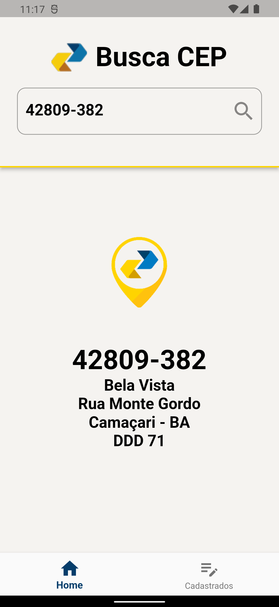

# 📫 CRUD Back4app
## Sobre o projeto

O aplicativo utiliza a API [VIA CEP](https://viacep.com.br) para consultar informações de CEP e, realiza operações CRUD (Create, Read, Update, Delete) para endereços, armazenando os dados com o serviço [Back4App](https://www.back4app.com). 
Isso permite aos usuários criar novos registros de endereços, atualizar informações existentes e excluir entradas quando necessário.

## Screenshots

  

### Tecnologias utilizadas

* Flutter
* Bloc
* Back4App
* ViaCep API

### Desenvolvedora

<a href="https://www.linkedin.com/in/jusy-lopes/" > 

  
